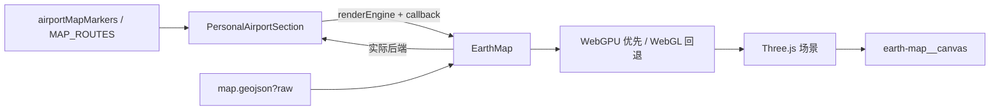

# 三维机场足迹地球（`EarthMap`）

`src/pages/personal/sections/EarthMap.tsx` 是个人记录页的三维机场足迹视图。它复用二维地图和航线图的机场、航段数据，在 Three.js 场景中绘制默认缓慢自转、可手动浏览的地球、大洲、航线和机场标记。

当前接入页面为 `/personal` 的「地球」展示模式，并可在全屏状态切换 WebGPU 或 WebGL 后端。

---

## 文件与职责

| 文件 | 职责 |
| --- | --- |
| `src/pages/personal/sections/EarthMap.tsx` | Three.js 场景、球面几何、交互、渲染器初始化及清理 |
| `src/pages/personal/sections/PersonalAirportSection.tsx` | 地图/地球/航线图模式切换、全屏展示、渲染器选择和实际后端状态展示 |
| `src/pages/personal/constants/airportsMap.ts` | 共享的 `airportMapMarkers` 与 `MAP_ROUTES` 数据 |
| `src/components/map/map.geojson` | Natural Earth 国家边界和 `CONTINENT` 属性，供大洲填充与轮廓使用 |
| `src/pages/personal/index.css` | 地球容器、tooltip、图例和移动端布局 |
| `src/App.css` | 深浅主题下的地图容器、图例、tooltip 等 `--pl-map-*` token |
| `rsbuild.config.ts` / `src/env.d.ts` | GeoJSON `?raw` 导入支持 |

## 组件接口

```ts
type EarthRenderEngine = "webgpu" | "webgl";

interface EarthMapProps {
  markers: WorldMapMarker[];
  routes: WorldMapRoute[];
  ariaLabel: string;
  renderEngine: EarthRenderEngine;
  onRendererReady: (renderEngine: EarthRenderEngine) => void;
}
```

`markers` 和 `routes` 与 `AnnotatedWorldMap` 共享同一套类型和数据契约。`scope` 仍只有 `domestic` 与 `international`：地球模式按它区分国内、国际航线的颜色与透明度；机场标记则使用统一的主题色和尺寸规则。

业务侧使用方式：

```tsx
<EarthMap
  ariaLabel="机场打卡三维地球"
  markers={airportMapMarkers}
  routes={MAP_ROUTES}
  renderEngine={earthRenderEngine}
  onRendererReady={handleEarthRendererReady}
/>
```

`EarthMap` 没有内部的渲染器选择状态。父组件拥有用户偏好和实际后端状态，因此切换引擎、显示回退结果和全屏工具栏始终保持一致。

---

## 运行关系



父组件切到「地球」模式时挂载 `EarthMap`。进入全屏后，整个可视化会通过 React Portal 移到 `document.body`，避免页面入场动画的 `transform` 限制 fixed 覆盖层尺寸；地球实例随重新挂载而重新初始化。

---

## 渲染后端

### 选择与降级

1. 父组件默认请求 `webgpu`。
2. `EarthMap` 检查 `navigator.gpu`，存在时创建 `WebGPURenderer` 并等待 `renderer.init()` 完成。
3. WebGPU 不可用或初始化抛错时，释放未完成的 WebGPU 渲染器，改用 `THREE.WebGLRenderer`。
4. 初始化成功后调用 `onRendererReady(actualEngine)`，父组件据此显示实际后端。

因此用户选择 WebGPU 但设备不支持时，工具栏会保留 WebGPU 的选择偏好，同时显示 `WebGL（已降级）`。选择 WebGL 时则跳过 WebGPU 尝试，直接创建原有 WebGL 渲染器。

### 何时重建

地球场景 effect 依赖 `renderEngine`、`markers`、`routes`、`isDarkTheme` 和 `onRendererReady`。以下变化会销毁当前场景并重新创建：

- 用户切换 WebGPU/WebGL。
- 切换深浅主题。
- 机场标记或航线数据引用变化。
- 从普通视图进入或退出全屏，使 `EarthMap` 挂载位置改变。

这属于有意设计：Three.js 渲染器、材质与主题颜色需要成组保持一致，避免同一 canvas 上混用旧资源和新状态。

---

## 场景层级与绘制顺序

场景使用一个 `globeGroup` 承载地理对象，初始绕 Y 轴偏转，使亚洲与当前航线优先进入视野。

| 层 | 几何 / 材质 | 半径或位置 | 作用 |
| --- | --- | --- | --- |
| 地球底球 | `SphereGeometry` + `MeshPhongMaterial` | `1` | 海洋底色、弱自发光与基础光照 |
| 经纬网 | wireframe `SphereGeometry` | `1.002` | 辅助定位，低透明度显示 |
| 大洲填充 | 按洲合并的 `BufferGeometry` + `MeshBasicMaterial` | `1.005` | 复用二维地图的大洲配色 |
| 国家轮廓 | `THREE.Line` | `1.008` | 国界与海岸线，位于填充层上方 |
| 大气层 | 背面 `SphereGeometry` | `1.055` | 轻量外沿氛围 |
| 航线 | `THREE.Line` | 高于球面 | 国内/国际航段弧线 |
| 机场 | 单位 `SphereGeometry`，逐帧缩放 | 表面半径 `1.028` | 机场点，供 Raycaster 命中 |

大洲填充与轮廓使用不同半径，避免 z-fighting。轮廓使用 `THREE.Line` 而不是 `THREE.LineLoop`，因为 WebGPU 渲染器不支持 `LineLoop`；闭合效果由手动补齐首尾点实现。

---

## 坐标与几何实现

### 经纬度到球面

输入坐标为 `{ lat, lng }`（角度）。转换函数先转弧度，再按下式投射：

```text
x = R * cos(lat) * sin(lng)
y = R * sin(lat)
z = R * cos(lat) * cos(lng)
```

所有航线、机场、大洲边界和填充网格都基于同一函数，避免二维/三维坐标定义不一致。

### 航线

航线使用起终点单位向量的线性插值后归一化，再根据进度增加高度：

```text
routeLift = 0.045 + sin(progress * PI) * 0.2
```

每段采样 48 个分段。国内航线使用较低饱和度、较低透明度的颜色，国际航线使用更亮的颜色。

### 机场标记尺寸

二维地图将机场绘制半径定义为 `MARKER_RADIUS = 5.6` 个 CSS 像素，缩放地图时尺寸不变，hover 时放大至 `1.12` 倍。地球模式直接复用该常量：每一帧根据机场在相机视空间中的深度、相机垂直 FOV 和容器高度，换算出对应的世界坐标半径并设置到单位球体的 `scale`。

初始化阶段会在 `globeGroup` 设定初始偏航后缓存各机场的世界坐标。地球组本身不在交互过程中旋转，OrbitControls 只移动相机，因此每帧只更新相机矩阵和机场缩放，不必遍历大陆、航线等完整场景层级。

因此滚轮缩放地球时，标记在屏幕中的视觉尺寸与二维地图一致；机场随球面远近变化时也能保持可读，当前悬停点仍具有与二维地图相同的放大反馈。Raycaster 使用已更新的 mesh 缩放进行命中检测。

### 大洲填充与轮廓

`map.geojson` 以 `[lng, lat]` 保存 `Polygon` 和 `MultiPolygon`。实现分为两条路径：

- **轮廓**：每一个 GeoJSON ring 都直接投射到球面，补齐闭合点后用 `THREE.Line` 绘制。
- **填充**：保留多边形的外环和内洞，用 `THREE.ShapeUtils.triangulateShape` 三角化，再按 `CONTINENT` 归入 8 个洲别网格。

填充路径还包含两项必要保护：

1. 连续化跨日期变更线的经度，避免平面三角化从地球另一侧穿过。
2. 由每个多边形中最长的三角边计算统一细分段数，使所有边保持在约 6 度弧长以内；细分后的顶点用重心插值再归一化回球面。

第二项非常重要。直接把大三角形的三个边界点连成平面，面片中央会落入底球内部并被深度缓冲遮挡，视觉上表现为大陆内的深色三角形空白。细分后，所有填充面持续贴合球面。统一段数还让相邻三角形沿共享边生成完全一致的球面顶点，避免不同细分密度造成 T 形接缝和细微线条空隙。

### 主题颜色

大洲填充颜色来自 `map.svg` 和 `map-light.svg` 的各洲填充色，转换为 Three.js 使用的 sRGB 整数。深浅主题变化会重建场景，切换对应色表。

容器背景、边框、tooltip 和图例仍由 `--pl-map-*` CSS token 控制，位于 `src/App.css`。Three.js 材质不能直接读取 SVG 里的 CSS 规则，因此大洲色表明确维护在 `EarthMap.tsx`。

---

## 交互与无障碍

| 场景 | 行为 |
| --- | --- |
| 默认自转 | `OrbitControls.autoRotate` 默认开启，使用 `GLOBE_AUTO_ROTATE_SPEED` 控制速度；用户拖拽时由手势接管 |
| 拖拽 | `OrbitControls` 绕地球旋转，启用阻尼，禁止平移 |
| 滚轮 / 触控缩放 | 缩放距离限制在 `1` 到 `10` |
| 机场悬停 | Raycaster 对机场 mesh 做命中检测，显示名称和可选描述 |
| 指针离开 | 清空 tooltip 状态 |
| 容器尺寸变化 | `ResizeObserver` 更新相机宽高比和 renderer 尺寸 |
| 全屏 | Portal 覆盖视口；Escape 退出、锁定页面滚动，并将焦点还给入口 |

外层 `.earth-map` 使用 `role="img"` 和调用方传入的 `ariaLabel`。canvas 被标记为 `aria-hidden`，避免屏幕阅读器暴露无语义的 WebGL/WebGPU 画布；当前的拖拽和缩放说明保留在容器内部的辅助文本中。

---

## 生命周期与资源释放

初始化是异步的，因为 WebGPU 需要完成 `renderer.init()`。effect 使用 `isDisposed` 防止组件卸载后继续挂载 canvas：如果渲染器在卸载后才初始化完成，会立即执行 `renderer.dispose()`。

正常清理顺序：

1. 断开 `ResizeObserver`。
2. 停止 `renderer.setAnimationLoop`。
3. 移除 `pointermove` 和 `pointerleave` 监听。
4. `OrbitControls.dispose()`。
5. 遍历场景并释放几何体与材质。
6. `renderer.dispose()`，最后移除 canvas。

像素比被限制为 `min(devicePixelRatio, 2)`，以防高 DPR 屏幕在全屏时生成过大的渲染缓冲。

---

## 维护指南

### 新增机场或航线

不要在 `EarthMap` 内维护另一套坐标。应更新 `src/pages/personal/constants/airportsMap.ts` 的 `airportMapMarkers` 或 `MAP_ROUTES`，三种可视化模式会同步使用新数据。

### 调整视觉

- 调整容器、tooltip 和图例：修改 `src/pages/personal/index.css` 与 `src/App.css` 的 `--pl-map-*` token。
- 调整海洋、经纬网、航线和机场 3D 材质：修改 `EarthMap.tsx` 场景初始化部分。
- 调整默认自转速度：修改 `GLOBE_AUTO_ROTATE_SPEED`。渲染循环会把 `THREE.Clock` 的时间差传入 `controls.update(deltaTime)`，速度不会随帧率变化。
- 调整机场标记的视觉半径：修改二维地图的 `MARKER_RADIUS`；地球模式会自动复用。仅需调整地球 hover 倍率时，修改 `ACTIVE_MARKER_SIZE_MULTIPLIER`。
- 调整大洲颜色：同时核对 `map.svg`、`map-light.svg` 和 `EARTH_LANDMASS_*_COLORS`，保持二维/三维一致。
- 调整填充精度：修改 `LANDMASS_FILL_MAX_ARC`。角度更小会减少曲率误差，但会增加该多边形所有三角形的顶点数和初始化成本；不要改为按单个三角形各自使用不同的段数。

### 常见问题

| 现象 | 原因 | 处理方式 |
| --- | --- | --- |
| WebGPU 选择后显示 WebGL（已降级） | 浏览器未提供 WebGPU，或初始化失败 | 属于预期回退；检查浏览器和 GPU 支持情况 |
| 控制台提示 `LineLoop` 不受支持 | WebGPU 不支持该对象 | 使用闭合点序列的 `THREE.Line`，不要改回 `LineLoop` |
| 大陆内部出现三角形空白 | 填充三角形没有贴合球面，被底球深度遮挡 | 保留球面细分逻辑；不要只增加填充半径 |
| 大陆内部出现细微线条空隙 | 相邻三角形按不同段数投射球面，共享边出现 T 形接缝 | 保留多边形统一细分段数；不要恢复单三角形独立段数 |
| 地球缩放后机场点过大或过小 | 未通过 `resolveMarkerWorldRadius` 将 CSS 像素半径换算到世界坐标 | 保留单位球体和逐帧缩放逻辑；不要恢复固定世界半径 |
| 切换主题或引擎后地球短暂重建 | scene effect 的依赖变化 | 属于预期行为，旧 renderer 会在清理阶段释放 |
| GeoJSON 导入报模块或解析错误 | `?raw` 声明或 Rsbuild 静态资源规则缺失 | 同时检查 `src/env.d.ts` 与 `rsbuild.config.ts` |

---

## 验证建议

基础静态检查：

```bash
pnpm exec tsc --noEmit
git diff --check
```

视觉验收时至少覆盖：深浅主题、WebGPU 成功路径、WebGL 强制选择路径、WebGPU 回退路径、全屏切换、拖拽缩放、机场 hover，以及大陆填充是否仍有三角形空白。
