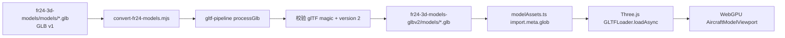

# FR24 模型转换技术方案

## 背景

`fr24-3d-models/models/` 中的 39 个 `.glb` 文件是 legacy GLB v1。Three.js 当前使用的 `GLTFLoader` 只支持 glTF 2.0，因此这些文件可以被 Rspack 发现，但不能在模型渲染页中解析，最终表现为模型加载失败。

同一目录还包含 `millennium_falcon.gltf` 和 `an225.gltf` 两个 glTF 1.0 JSON 文件。本方案只转换 39 个 GLB 文件；这两个 `.gltf` 文件不进入当前转换链路，避免把不兼容格式混入前端模型目录。

## 目标与边界

### 目标

- 将 FR24 的 legacy GLB v1 转为可由 Three.js `GLTFLoader` 加载的 GLB v2。
- 保留源文件名，输出目录与源仓库结构对应。
- 转换失败时给出逐文件错误，并以非零状态结束。
- 保留 FR24 源仓库的许可证文件，避免转换产物丢失许可信息。
- 转换过程可重复执行，不修改原始 Git 子模块。

### 非目标

- 不在浏览器中实现 glTF 1.0 解析器。
- 不修改 `fr24-3d-models` 子模块内的源文件。
- 不对模型进行 Draco 压缩、减面或重新贴图。
- 不在本方案中自动把转换结果提交到 Git 或发布到服务器。

## 目录约定

```text
plan-list/
├── fr24-3d-models/                 # Git 子模块，原始 legacy 模型
│   ├── LICENSE
│   └── models/*.glb
├── fr24-3d-models-glbv2/           # 本地转换产物，不改动上游子模块
│   ├── LICENSE                     # 转换时从源目录复制
│   └── models/*.glb                # GLB v2 输出
└── scripts/
    └── convert-fr24-models.mjs     # 批量转换脚本
```

模型页的资源清单 `src/pages/planeRender/modelAssets.ts` 扫描 `fr24-3d-models-glbv2/models/**/*.glb`，因此前端构建前必须先准备转换目录。

## 技术选型

### 转换器

使用 [gltf-pipeline](https://github.com/CesiumGS/gltf-pipeline) `4.3.1`。其 `processGlb(Buffer, options)` API 可以直接接收二进制 GLB，并返回包含转换后 `glb` Buffer 的 Promise；该工具会将 legacy glTF 1.0 转换为 glTF 2.0。

依赖位于 `package.json` 的 `devDependencies`，转换只发生在 Node.js 工具链，不增加浏览器运行时包体。

### 前端加载器

转换结果继续由 Three.js 的 `GLTFLoader.loadAsync()` 加载，并交给 `/plane-render` 的 WebGPU 视窗。前端不需要区分源模型是否来自 FR24，只消费已转换的 GLB v2 URL。

## 数据流



## 脚本设计

实现文件：`scripts/convert-fr24-models.mjs`

### 路径解析

脚本使用 `import.meta.url` 反推项目根目录，不依赖执行命令时的当前工作目录。无论从项目根目录还是其他目录调用，输入、输出和许可证路径都保持一致。

### 输入收集

1. 读取 `fr24-3d-models/models` 的直接文件项。
2. 只保留扩展名为 `.glb` 的文件，并按文件名排序。
3. 如果源目录为空，立即报错退出。

排序保证日志顺序和结果复现稳定；脚本不扫描 `.gltf`，因为当前前端加载器不支持 glTF 1.0。

### 转换与输出

对每个输入文件执行：

1. 读取为 Node.js `Buffer`。
2. 调用 `processGlb(sourceGlb, { keepUnusedElements: true })`。
3. 检查返回 Buffer 的前三项头信息：`glTF` magic、版本 `2` 和基本长度。
4. 写入同名文件到 `fr24-3d-models-glbv2/models/`。
5. 输出 `[当前序号/总数] 已转换 文件名` 日志。

转换按顺序执行，不使用 `Promise.all`，以降低 124 MB 源目录在转换时的峰值内存。

### 失败处理

- 单个文件读取、转换、校验或写入失败时，记录文件名和错误原因，继续处理后续文件。
- 全部文件处理结束后，如果存在失败项，汇总所有失败并抛出异常，进程以非零状态结束。
- 失败前已经写入的文件会保留，便于定位问题并在修复后重跑；脚本不会自动删除整个输出目录。

### 幂等性与更新策略

脚本会覆盖同名输出文件，因此可以安全重跑。它不会清理源目录已删除模型对应的旧输出文件；如果上游移除了模型，需要人工检查并清理输出目录中的孤立文件。

`updateModule.sh` 只负责更新 Git 子模块，不会自动触发模型转换。更新 FR24 子模块后，应显式重新执行转换脚本，再检查输出差异。

## 执行方式

首次准备或换机器时：

```bash
pnpm install
node scripts/convert-fr24-models.mjs
```

预期结果：

- 输出目录：`fr24-3d-models-glbv2/models/`
- 转换数量：当前 39 个 `.glb`
- 许可证副本：`fr24-3d-models-glbv2/LICENSE`

缺少依赖时，脚本会提示执行 `pnpm add -D gltf-pipeline`；正常项目安装流程应优先使用仓库已声明的 `package.json` 和 `pnpm-lock.yaml`。

## 验收方案

本方案的最低静态验收包括：

1. 执行脚本日志中 39 个文件均显示“已转换”。
2. 随机抽查和批量检查输出文件的前 12 字节，magic 为 `glTF`，版本字段为 `2`。
3. 检查输出文件数量与源 `.glb` 数量一致。
4. 检查源子模块工作区无修改，转换只产生根目录输出文件。
5. 在模型页面选择 FR24 模型，确认 `GLTFLoader` 不再报告 `Legacy binary file detected`。

浏览器验收还应覆盖 WebGPU 初始化失败、单个模型加载失败、模型切换、全屏和缩放。构建或服务启动由项目维护者按约定单独执行，本次文档整理不代为运行。

## 许可证与分发注意事项

FR24 仓库的 `LICENSE` 说明，大多数模型以 GPLv2 授权，个别模型可能有独立授权说明。转换不会改变上游授权，输出目录保留源许可证只是最低的文件完整性措施，不代表自动解决应用分发时的许可证义务。

在公开发布包含这些模型的应用、构建产物或转换文件前，应保留来源链接和对应许可证，并由项目维护者确认 GPLv2 对具体分发形态的要求。该文档只记录工程流程，不构成法律意见。

## 故障排查

| 现象 | 可能原因 | 检查方式 |
| --- | --- | --- |
| 页面目录显示 0 个 FR24 模型 | 转换目录不存在或 glob 未命中 | 检查 `fr24-3d-models-glbv2/models/` 和构建资源扫描路径 |
| `Legacy binary file detected` | 页面仍加载原始 GLB v1 | 检查 `modelAssets.ts` 是否指向 `fr24-3d-models-glbv2` |
| 脚本提示缺少 `gltf-pipeline` | 依赖未安装或 pnpm 链接未完成 | 执行 `pnpm install`，再检查 `pnpm list gltf-pipeline` |
| 个别转换失败 | 源文件损坏、格式异常或转换器不兼容 | 查看脚本逐文件错误，单独保留输入复现 |
| 输出存在但模型仍不显示 | 浏览器 WebGPU 或 GLTFLoader 运行时问题 | 先检查模型 v2 头，再检查浏览器控制台与 WebGPU 支持 |

## 后续演进

- 为输出增加源文件哈希清单，只转换新增或发生变化的模型。
- 在转换结果旁记录转换器版本、源子模块 commit 和生成时间。
- 若需要支持两个 legacy `.gltf` 文件，先选择可验证的 glTF 1.0 转换链路，再单独评估其资源和许可证。
- 将转换脚本接入明确的资源准备命令，但不要在前端开发启动时隐式执行大批量转换。
